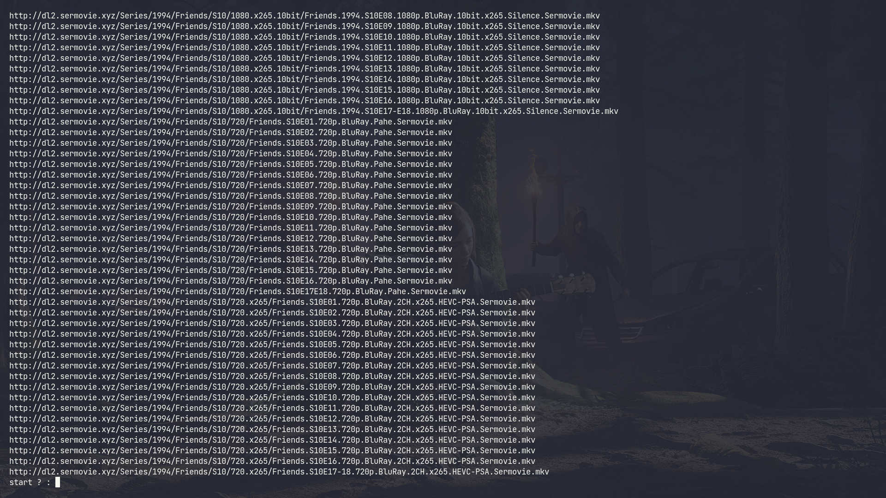

# Downloader 
This might happen to you , that you want to download a series , but you are a lazy like ME ! , and you don't want to copy and paste every part link into your downloader . 
This script might help you , because you get the link of the page and script scrap the whole website and download it if you want . 

## Usage 
First , Clone the repository : 

	git clone git@github.com:woxane/some-cool-scripts.git
	cd some-cool-scripts/Downloader

Second , run the script and pass the link  : 
	
	./downloader.py url=https://www.sermovie3.online/series/60bd24a49af58d2b7f8efbbf

And press Enter . 

## Optional
You can filter the output with -f flag . 
For example if you have a 100 links in a website (480p , 720p , 1080p , 2160p) or (Season one , two ... ) , you can pass the filters and get filtred links . 
This following command gives you links that have 720.x265 and S01 in their links  :

	./downloader.py -f=720.x265,S01 url=https://www.sermovie3.online/series/60bd24a49af58d2b7f8efbbf

