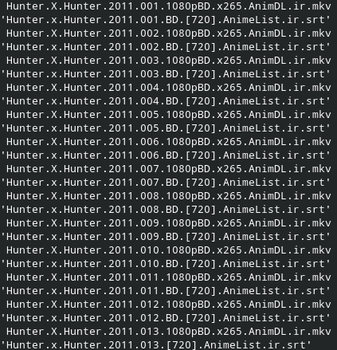

# Name-changer 
This script come to HELP you from wasting time to change name of the subtitle that when you open VLC (NOT SPONSERED) and start your movie , and FUCK !, you dont have subtitle , you must drag and drop the subtitle OR change the name of subtitle into your movie name . 

## Get , started 
As always i say , DON'T ACT LIKE IDIOT . Ok , you must get the script and put it in the movie file (What kinda movie naughty ) and run it . Just this . 
And i must say this script works for mkv : movie extension and srt : subtitle extension if your movie and subtitle extension is diffrent , change it .
And there is somthing else that i must say , this is not professional name changer and have some bugs (IDK) and works for this type of movie and subtitle name : 

You see ? there is sequence like , movie subtitle , movie subtitle , like this . this script worokd for this type of sequence . 
Good luck budy :)

